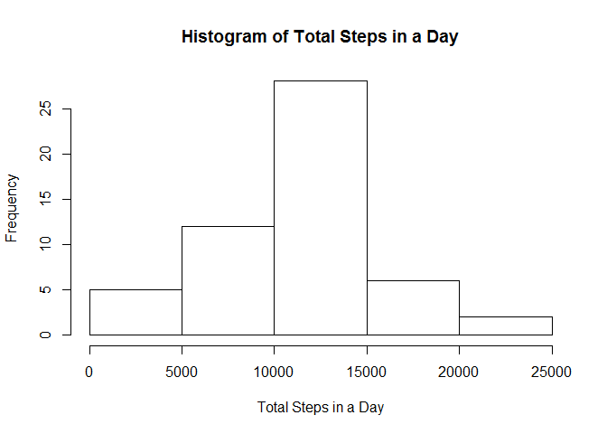
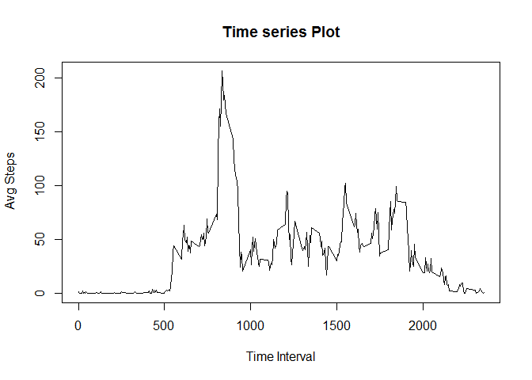
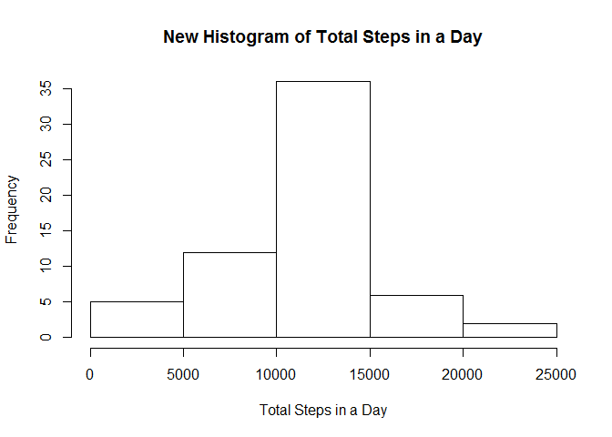
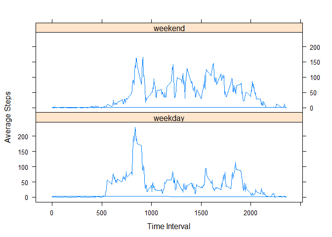

# Reproducible Research: Peer Assessment 1


```r
library(data.table)
```

```
## 
## Attaching package: 'data.table'
## 
## The following object is masked _by_ '.GlobalEnv':
## 
##     .N
```

## Loading and preprocessing the data


```r
data <- read.csv("activity.csv")
data <- data.table(data) # Coverting the Data to data.table format
data[,date:= as.Date(date, format = "%m/%d/%Y")] # Coverting the date column from Char to Date format
```


## What is mean total number of steps taken per day?
#### First, plotting the Histogram:

```r
stepsPerDay <- data[,sum(steps), by = date]
setattr(stepsPerDay, 'names', c("Date", "TotalSteps"))
hist(stepsPerDay$TotalSteps, main = "Histogram of Total Steps in a Day", xlab = "Total Steps in a Day")
```

 

#### Next, calculating the Mean and Median:

```r
mean <- mean(stepsPerDay$TotalSteps, na.rm = TRUE)
mean
```

```
## [1] 10766.19
```

The mean of 'Total Steps Per Day' is 1.0766189\times 10^{4}


```r
median <- median (stepsPerDay$TotalSteps, na.rm = TRUE)
median
```

```
## [1] 10765
```

The median of 'Total Steps Per Day' is 10765

## What is the average daily activity pattern?

#### First, creating the Time series plot:

```r
library(lattice)
avgstepsPerInt <- data[, mean(steps, na.rm = TRUE), by = interval]
setattr(avgstepsPerInt, 'names', c("interval", "AvgSteps"))
plot(avgstepsPerInt$interval, avgstepsPerInt$AvgSteps, type = "l", main = "Time series Plot", ylab = " Avg Steps", xlab = "Time Interval")
```

 

#### Next, finding the interval that has the highest number of steps on average:

```r
index <- avgstepsPerInt[, .I[which.max(AvgSteps)]]
intMax <- avgstepsPerInt[index, interval]
intMax
```

```
## [1] 835
```

So the Interval that has the highest number of steps on average is 835   

## Imputing missing values

#### 1. Calculating the number of missing values

```r
missing <- data[,is.na(steps)]
numMissing <- sum(missing)
numMissing
```

```
## [1] 2304
```

So the number of missing values in the steps column is 2304

#### 2. Let's use  the  corresponding interval  means to fill the missing data

#### 3. Creating a new dataset by filling the missing values using the above strategy

```r
newData <- data.frame(data)
for (i in 1:17568) {
  if (missing[i]) {
    if ((i %% 288) == 0) {
      newData[i, "steps"] = avgstepsPerInt[288, AvgSteps]
      }
      else (newData[i, "steps"] = avgstepsPerInt[(i%%288), AvgSteps])
  }
}
```

#### 4. Plotting the Histogram for Total Steps after filling in missing values


```r
newData <- data.table(newData)
newstepsPerDay <- newData[,sum(steps), by = date]
setattr(newstepsPerDay, 'names', c("Date", "TotalSteps"))
hist(newstepsPerDay$TotalSteps, main = "New Histogram of Total Steps in a Day", xlab = "Total Steps in a Day")
```

 

#### And, calculating the new mean and median

```r
newmean <- mean(newstepsPerDay$TotalSteps, na.rm = TRUE)
newmean
```

```
## [1] 10766.19
```

```r
newmedian <- median (newstepsPerDay$TotalSteps, na.rm = TRUE)
newmedian
```

```
## [1] 10766.19
```

The new mean of 'Total Steps Per Day' is 1.0766189\times 10^{4}  
The new median of 'Total Steps Per Day' is 1.0766189\times 10^{4}

The mean remained the same whereas the median increased very very slightly. The reason being, we replaced the missing values with the mean value for that time interval across all days which wouldn't affect the mean and only moved the median a little bit due to the increased number of valid observations.

## Are there differences in activity patterns between weekdays and weekends?

#### Adding a column weekday to indicate which day of the week that date is


```r
newData[, dayType := factor(ifelse(wday(date) %in% c(1,7), "weekend", "weekday"))]
```

#### Calculating the Average steps per interval for weekdays and weekends 

```r
newData[, AvgSteps:= mean(steps), by = .(interval, dayType)]
```

#### And then plotting those averages against the time intervals

```r
xyplot(newData$AvgSteps~newData$interval|newData$dayType, type = "l", xlab = "Time Interval", ylab = "Average Steps", layout = c(1,2))
```

 

From the above plots we can see that there is more activity in the morning during the weekdays than on weekends. We can also notice that there is more activity during the day on weekends than on weekdays. We can further notice that the activity continues into late evening during the weekends than during the weekdays.
